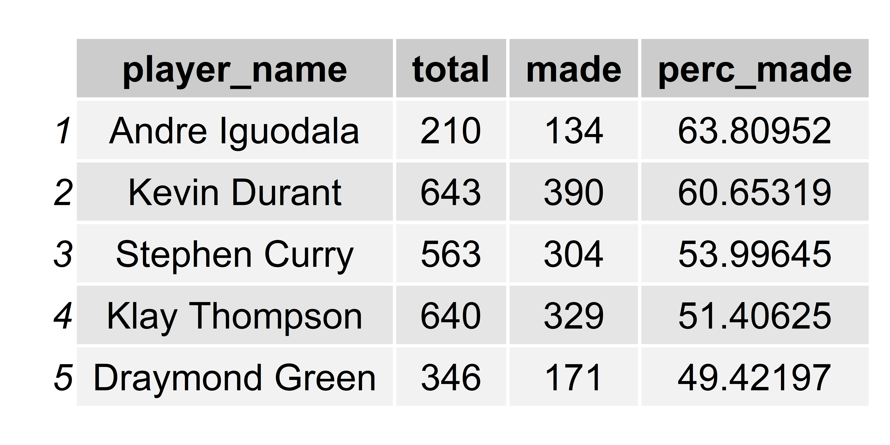
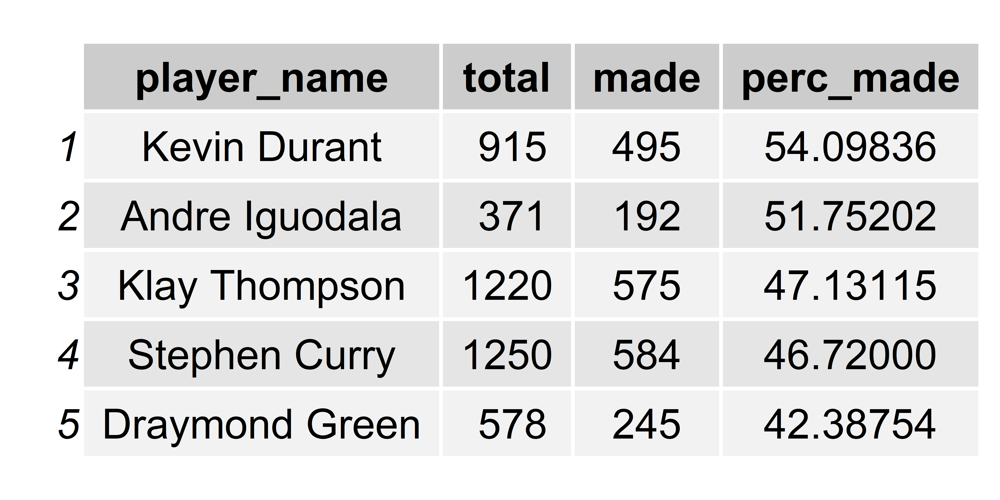

Workout 1
================
Kevin Rosenberg
March 5, 2019

In the high-powered offenses of today's NBA, there is a lot of emphasis on the 3-point shot, especially in the case of our Golden State Warriors. However, two aspects which are often overlooked is effective accuracy, and shot location. In this article, we'll dive into some statistics to see which GSW players should be shooting more, which should be shooting less, and from where.

Consider the following table, which details the shooting percentage of 5 GSW players (Steph Curry, Andrew Iguodala, Kevin Durant, Klay Thompson, and Draymond Green) from 2PT range:

From the above, we surprisingly see that Andre Iguodala is the Warrior's most effective shooter from 2PT range. Why might this be? In order to better understand these results, let's take a look at the shot charts for these 5 players:

Looking at only the shots inside the 3PT line, Iguodala's success becomes more clear. Most fans of the Warriors will doubtless know that Curry, Durant, and Thompson are all mroe gifted shooters and scorers than Iguodala. Here, we see that his percentage from 2PT range is higher because a much greater percentage of his 2PT shots come very close to the basket, while many of Curry, Durant, and Thompson's 2PT shots are jumpshots. Despite the fact that they are all more gifted scorers than Iguodala, this isn't enough to balance out the fact that closer shots are made more often, plain and simple. Curry, Durant, and Thompson's numbers are in fact quite excellent given the volume and difficulty of shots they take, while Iguodala is more selective (choosing not to take as many jumpshots), and therefore has a higher percentage.

In fact, between Durant, Klay, and Steph, KD is by far the more gifted scorer from 2PT range. The reason for this is probably twofold; first, he's a lot bigger than Steph or Klay, so he can get to the basket more easily. Second, his game is more centered around scoring overall, while the Splash Brothers' game is more centered around shooting 3's. So it makes sense that Durant is mroe effective from 2PT range than Steph or Klay.

This leaves Draymond Green. It doess seem that an even greater percentage of his shots are closer to the rim than Iguodala, yet his percentage from 2PT range is lower than anyone! This really indicates that Green is simply not a player that should be relied on heavily in the Warrior's offense. It would seem more efficient for Iguodala to be attempting more shots than Green, though these numbers are somewhat deceptive, as they don't account for the fact that Green plays more minutes, and therefore will naturally attempt more shots.

Let's now turn to the 3PT shooting of these players, summarized in the table below:

These numbers better reflect what we'd expect from watching the games. The Splash Brothers, Thompson and Curry, are excellent 3 point shooters, and lead the way in percentage, despite taking by far a higher volume of shots, which means that their shots will be more difficult on average. Durant, also an excellent shooter, has a pretty decent percentage, though the numbers bear out that he is not quite the 3PT shooter that Steph and Klay are, Iguodala's percentage is respectable, mostly because he is able to be very selective with his shots, taking far fewer than any of the other four players. Green is admittedly a struggling shooter, and should likely consider taking fewer shots from 3PT range as well.

Let's now look at the 5 player's overall shooting percentage, including 2 and 3 point shots:

Overall, the 2-time scoring champion Kevin Durant could be argued to carry the day as the Warrior's most effective offensive player. Then again, Klay and Steph take many more 3's than KD, so it could also be argued that even though their overall shooting percentage is lower, their effective shooting percentage is higher than KD's if the value of the 3PT shot is accounted for, I'm partial to simply saying that all 3 are amazing offensive players, that should each stick to their own strengths. While Iguodala is second in shooting percentage, there is no real argument that he is a more effetive offensive player than either of the Splash Brothers, for the reasons discussed earlier regarding his ability to be selective with his shots.

Lastly, let's take a look at the shot charts for these 5 players again, and see if we can learn anything more about where these players should be trying to shoot from on the court. For convenience, here are the shot charts again:

Looking at Iguodala's shot chart, there seems to be a consistent pattern that he is more effective shooting on the right side of the court, particularly inside the arc. Durant seems to struggle from 3 in the right corner, but thrive from the left corner. Lastly,from inside the arc, Curry seems to shoot much better on the left side of the court than on the right side. These players could likely improve their percentages in game if they focus on taking more shots from these 'hot spots'.

In conclusion, we've seen that KD and the Splash Brothers are really magnificent offensive players, with the Splash Brothers being most effective from 3, while KD is best from inside the arc. We've also seen that, if possible, Iguodala should perhaps try to take more shots, with Draymond taking fewer shots. However, it is possible that if Iguodala lowers his standard for shot selection, then his percentage might suffer. Lastly, we pointed out a few noticeable hot and cold spots on the court for some of the players. As avid Warriors fans, we can only hope that our already dynamic offense can be improved upon by following the suggestions that this data points towards!
